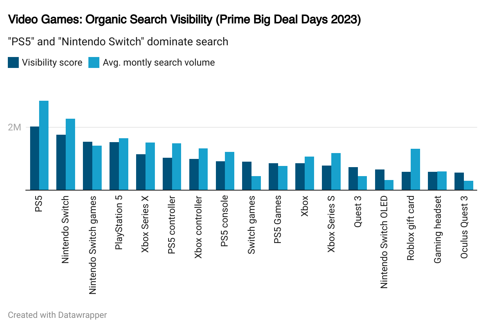
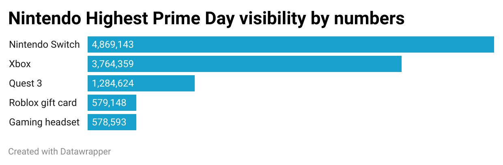
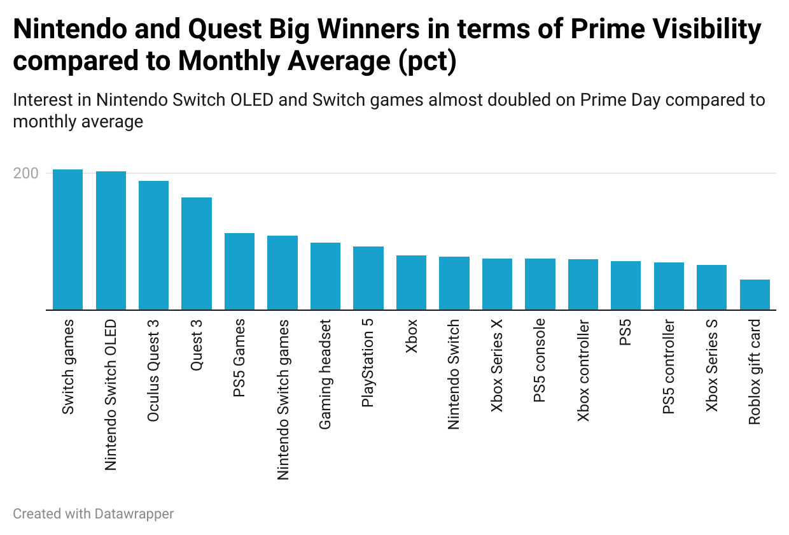
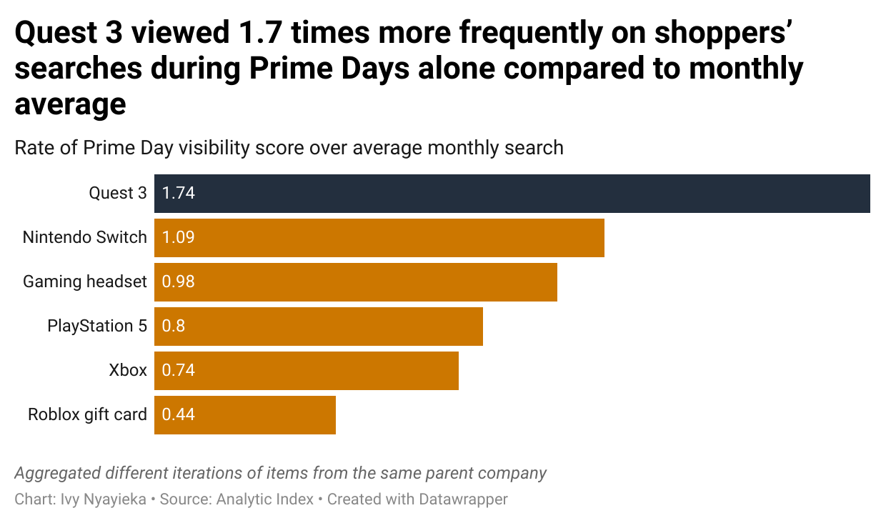

# PS5, Nintendo and Quest Big Winners on Prime Big Deal Days

This is an analysis into trends in organic search visibility on Prime Big Deal Days.  

### Getting the Data

Source: [Analytic Index - Amazon Prime Big Deal Days 2023 Ultimate Recap](https://8717401.fs1.hubspotusercontent-na1.net/hubfs/8717401/Prime%20Big%20Deal%20Days%202023/Analytic%20Index%20-%20Amazon%20Prime%20Big%20Deal%20Days%202023%20Ultimate%20Recap.pdf)

Here are the definitions of each column for reference:  

* Organic search: The unpaid listings that appear on a search engine results page.
* Search Visibility Score: A composite metric used to estimate how often this product/brand/category was viewed in shopper searches. It is estimated using the number of keywords, search volume, item search rank, and number of days items appeared in the search result slots.
* Avg. monthly search: The number of times the keyword has been searched on Amazon on an average per month."	

### Analysing the data

Calculated portion_of_visibility_score_over_monthly_search by dividing Prime Day Visibility score over Avg. montly search volume:  
Also made the decision to consolidate the searches by parent company to inspect trends at a collated level. Here is the [resulting csv of data consolidated by parent company](https://github.com/ivynyayieka/warc_prime_deals/blob/main/company%20DC%20data%20journalist%20exercise.csv)

### Exploratory plotting
Used Datawrapper to look at trends. 

# Final Visualization

## Frequency of item’s viewership in shopper searches
Used the Python version since it appeared slightly neater than R, used parent company to determine colour groups

#### Tech
Microsoft Excel, Python, R, Datawrapper
